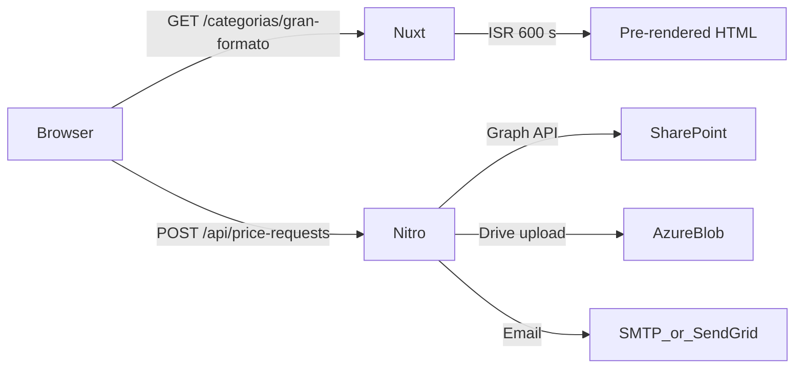

Reprodisseny's web platform is a Nuxt 4 application that combines static-site generation (SSG) with incremental static regeneration (ISR). Content is managed in SharePoint, synced to local JSON at build time, and served through Nitro server routes. File attachments and media assets are stored in Azure Blob Storage.

<CardGroup cols={2}>
  <Card title="Frontend" icon="monitor" href="/developer/tech-stack">
    Vue 3 + Nuxt 4, Tailwind CSS, shadcn-nuxt, reka-ui. Pages are pre-rendered at build time and revalidated on a per-route schedule.
  </Card>
  <Card title="Backend" icon="server" href="/developer/api/price-requests">
    Nitro server routes handle form submissions, search, and CMS data. Rate limiting uses a local SQLite database via better-sqlite3.
  </Card>
  <Card title="CMS" icon="database" href="/developer/sharepoint-cms">
    SharePoint Lists are the source of truth for categories, products, and price requests. A sync script fetches data via Microsoft Graph and writes `cms/catalog.json` before each build.
  </Card>
  <Card title="Integrations" icon="plug" href="/developer/azure-storage">
    Azure Blob Storage hosts media assets and quote-request attachments. Email notifications are sent via SMTP or Microsoft Graph/SendGrid depending on the configured provider.
  </Card>
</CardGroup>

## Request lifecycle



## Route caching strategy

| Route pattern | Strategy | TTL |
|---|---|---|
| `/categorias/**` | ISR | 600 s (10 min) |
| `/api/categorias/**` | SWR | 300 s (5 min) |
| `/productos/**` | ISR | 600 s (10 min) |
| `/api/productos/**` | SWR | 300 s (5 min) |

These values are set in `nuxt.config.ts` under `routeRules`.

## Data stores

| Store | Purpose | Access |
|---|---|---|
| SharePoint CMS Lists | Categories, products, page content | Microsoft Graph API (build-time sync) |
| SharePoint CRM Lists | Price request submissions, comments | Microsoft Graph API (runtime) |
| Azure Blob (`webcms` container) | Media images, quote attachments | Public CDN + Drive API |
| SQLite (in-process) | IP-based rate limiting | better-sqlite3 (runtime only) |

## Key directories

```bash
server/
├── api/
│   ├── price-requests.post.ts     # Quote request submission
│   ├── categorias.get.ts          # Full category catalog
│   ├── search/
│   │   └── suggest.get.ts         # Fuzzy search suggest
│   ├── nav/
│   │   └── categorias.get.ts      # Navigation tree
│   ├── home/
│   │   └── categorias.get.ts      # Home page featured categories
│   ├── places/
│   │   └── reviews.get.ts         # Google Places reviews
│   └── cms/
│       ├── categories.get.ts      # CMS category list
│       ├── products.get.ts        # CMS product list
│       ├── category/
│       │   └── [...slug].get.ts   # Category detail by path
│       └── product/
│           └── [slug].get.ts      # Product detail by slug
├── services/
│   └── priceRequests/
│       └── priceRequestService.server.ts
└── utils/
    ├── rateLimit.server.ts
    └── cmsCatalog.server.ts

composables/
├── usePriceRequests.ts
├── useCategoriasNav.ts
├── useProductsCatalog.ts
├── useCategoriaProductos.ts
├── useHomeCategoriesGrid.ts
└── useSeoContent.ts

scripts/
└── sync-sharepoint-to-cms.mjs    # SharePoint → cms/catalog.json

cms/
├── catalog.json                  # Generated by cms:sync
└── routes.json                   # Pre-render route list
```
